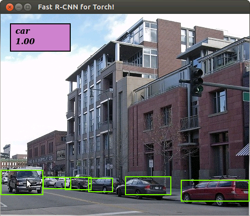

# Torch implementation of the Fast R-CNN
This is a torch implementation of the Fast R-CNN proposed by Girshick et .al. [1].
## Requirements
* You need to install torch.
* The current implementation uses these torch packages: ```nn, inn, cudnn, image, matio, optim, paths, xml, dkjson ```
* You need a machine with CUDA GPU.
*  You need to download the required weights and proposal files as discussed below.

## Running the demo
For running the demo you only need to download the weights of the Fast R-CNN network. Please run ``` ./scripts/get_frcnn_models.sh``` to get the trained Fast R-CNN models (currently AlexNet trained on VOC2007 trainval set). After downloading the weights file you can run the demo in the terminal as follows:
```lua
qlua demo.lua
```
After running this file you should see the following detections:


## Training the Fast-RCNN network
For training the Fast R-CNN network, you should download the pre-trained models, object proposals, and the Pascal VOC dataset. You can download the pre-trained AlexNet model and object proposals for VOC by running ```./scripts/get_imgnet_models.sh``` and ```./scripts/get_proposals.sh```. Please download the VOC Devkit training data as well.

Now you can train the model by calling ```th main_train.lua```. However, you should specify the required options appropriately. For a list of complete options run ```th main_train.lua -help```. 

* At least you need to specify the path to the parent directory of the VOC devkit folder by setting ```-dataset_path 'path to the directory' ``` (the default is ```./data/datasets/```) and the name of the VOC devkit folder by setting ```-dataset 'name of the root folder' ``` (the default is ```voc_2007```). 
* You can change the training set from *trainval* to *train* by passing ```-train_img_set 'train'```.
* If you want to train a model other than AlexNet, you need to add a Lua definition of the model  in the ```./models``` folder and pass its location by setting the ```-model_def 'path to the model definition' ``` option. In that case, you probably need to specify the appropriate pre-trained model for fine-tuning by passing the  pre-trained path by setting the ```-pre_trained_file 'path to the pre-trained file' ```.
* The models together with a text file describing the configuration of the training will be saved into the ```./data/trained_models/```. You can change this directory by passing the ```-save_path 'your new path to save the models'``` option. 
* The loss values and the loss diagrams will be saved into ```./data/log/```. You can change it by passing ```-log_path 'new path for saving the log files'```.

## Testing the Fast-RCNN network
Currently, you need Matlab to use the VOC evaluation functions. Please download the VOC2007 test data if you want to test on the test set. You can test your trained model by running ```th main_test.lua``` and passing the required options:
* Pass the path to your trained model by setting ```-model_weights 'path to the file containing the weights of your trained model'``` and declare your model definition by passing the ```-model_def 'path to the model definition'``` (if you are testing a model other than AlexNet).
* Set the path to the parent directory of the VOC devkit directory by passing the ```-dataset_path 'path to the directory'``` and the name of the VOC devkit root directory by passing the ```-dataset 'name of the root folder'```.
* You can change the test imageset by passing ```-test_img_set 'your test set'```.
